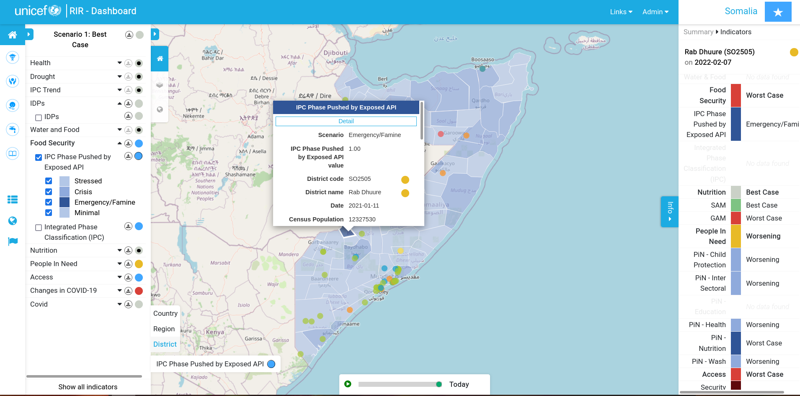

[//]: # "GeoSight is UNICEF's geospatial web-based business intelligence platform."
[//]: # 
[//]: # "Contact : geosight-no-reply@unicef.org"
[//]: # 
[//]: # ".. note:: This program is free software; you can redistribute it and/or modify"
[//]: # "    it under the terms of the GNU Affero General Public License as published by"
[//]: # "    the Free Software Foundation; either version 3 of the License, or"
[//]: # "    (at your option) any later version."
[//]: # 
[//]: # "__author__ = 'irwan@kartoza.com'"
[//]: # "__date__ = '13/06/2023'"
[//]: # "__copyright__ = ('Copyright 2023, Unicef')"
[//]: # "__copyright__ = ('Copyright 2023, Unicef')"

# User Guide

This section of the documentation describes a narrative for users on how to use the platform. The guide is intended to function as narrative / workflow based tutorials for the platform. For more in-depth explanations of all functionality, you may prefer to look at our [user manual](../manual/index.md).

## What is the Risk Informed Response platform?

The platform provides a way to understand risk modalities across different geographic contexts. Some key features include:

* **Traffic light** system to show an at a glance status for each risk indicator
* **Program intervention** system which shows the traffic light status across different programmes such as health, security etc.
* Side-by-side comparison of risk factors (indicators) using a **map swiping** tool
* **Indicators** - risk factors which can be harvested form external sources and displayed in the map and dashboard
* **Interactive map** - click, drag, drill down into information on the map and open corresponding dashboards and details
* **Harvesters** that can automatically update indicators from different data sources such as web API's
* a complete and **user friendly administration** environment to manage the system
* Role based **user management**

## Sections of the Guide

1. [Platform Tour](platform-tour.md): This is an overview tour of the GeoSight Platform.
2. [Map Interactions](map-interactions.md): This is an explanation of how a user can interact with the map.
3. [Indicators](indicator.md): This section is an explanation of the indicators on the platform.
      1. [Adding Indicators](adding-indicators.md): This section explains how a user can add indicators to GeoSight.
4. [Layers](layers.md): This section explains how users can interact with layers on GeoSight.
5. [User Tutorial](user-tutorial.md): This is a tutorial on how a user can use GeoSight.
6. [Projects](projects.md): This section explains how GeoSight uses projects to organise information.
      1. [Sharing Projects](sharing-projects.md): This shows how projects can be shared.
7. [Data Access](data-access.md): This is an explanation of accessing data on GeoSight.
8. [Disclaimer](../../about/disclaimer.md): This is the project disclaimer.
9. [Credits](../../about/credits.md): These are the credits relating to the project.
10. [License](../../about/license.md): This is the project license.
